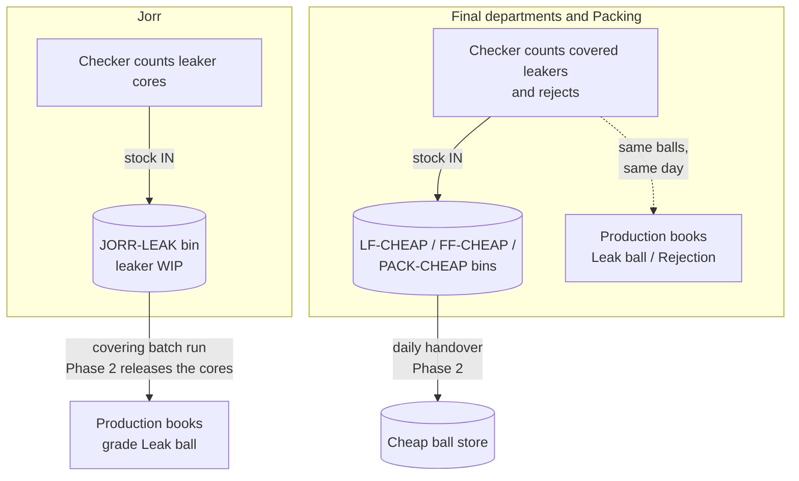

# R&W Ball Inventory — Working Flow

How the ball inventory works day to day, for the people running it: the floor
checkers, the production clerks, and the managers reading the reconciliations.
Design rationale lives in `docs/REJECTION_WASTAGE_INVENTORY_PLAN.md`; what was
shipped and when in `docs/RW_BALL_INVENTORY_CHANGELOG.md`.

**Live from 1 September 2026.** Entries dated before the cutover are history
only — they post no stock.

> **Isolated from Production since 23 September 2026**
> (`20260923120000_rw_isolate_from_production`). R&W no longer writes to or
> reads from production entries. A checker's count posts to the R&W ball
> ledger and bins and nothing else; *Qty OK* / *Qty Rejected* are typed on
> Daily Production Entry again for every date. The reconciliation views
> against production were removed. R&W still *reads* the shared masters
> (grades, departments, materials, employees) for its dropdowns. Draft
> production entries whose figures R&W had derived were reset to
> rejected = 0 / OK = produced for re-entry (old values kept in
> `production_entries_rw_reset_backup`); posted entries were left as posted.
> Sections below describe the current behaviour.

---

## The idea in one paragraph

A leaker or reject ball is not waste — it is a countable ball that gets sold
cheap. So the checker's daily count now creates **stock in a bin**, and that
stock has to reconcile with what happens next: leaker cores must come back out
as *Leak ball* production after covering, and covered leakers and rejects must
match the cheap-ball production the same department books the same day. A
number that used to be a bare claim now has physical inventory behind it.

**Identity is the production grade** (LB, KB, T, VM…) — the same master the
production module books against, and the same identity the floor has always
used ("JORR VM72", "FINAL T70 YELLOW"). Counts, bins, ledger and rates are all
per grade × defect type; individual sales SKUs are not tracked here.

## How a ball flows

The checker's count feeds the bins and the ball ledger only. Production's
*Qty Rejected* / *Qty OK* are recorded separately on Daily Production Entry.

---

## Daily routine

### The floor checker — once per day, per department

Open **Rejections & Wastages → Daily Checker Entry**.

1. Pick the date, department, shift, and (optionally) your name as checker.
2. The grid is already shaped for you: **columns** are the defect grades your
   department counts (Jorr sees only *Leaker — core*; Local/Fancy Final see
   *Leaker — covered* plus the two rejects; Packing sees the two rejects).
   Add a **row** per grade you counted. The destination bin is shown at the
   top — you never pick a location.
3. Type the day's quantities per grade.
4. Optional: expand a cell's chevron to record the interval tally (your
   through-the-day counts). If you use it, the intervals **must add up to the
   day total** — the save refuses otherwise. Leave it empty and the day total
   saves on its own.
5. **Save day's count.** One save per day; re-opening the same day lets you
   correct it (the bin stock follows automatically).

Things the screen will tell you:

- A day/grade/defect can only exist **once** — a duplicate save is refused
  rather than silently doubling the count.

### The production clerk

On **Daily Production Entry**, *Qty OK* and *Qty Rejected* are typed as they
were before R&W, for every date, with the per-reason rejection card. Draft
entries from 1 September onward whose figures R&W had filled in were reset to
rejected = 0 / OK = produced and need their rejected figure re-entered.

Keep booking cheap-ball output as before (or start): production of grade
**Leak ball** (covered leaker cores, and covered leakers) and grade
**Rejection** (rejects), booked by the department that found the defect,
recording the **finished** balls.

---

## What the manager watches

All on **Rejections & Wastages → Floor Bin Stock** (plus the Ball Ledger for
drill-down):

Bin quantities and value per bin, grade and defect grade, with age of the
oldest stock. The reconciliations against production entries (counted vs
booked, leaker WIP vs covering output, posted-entry conflicts, coverage and
defect %) were removed when R&W was isolated from production.

**Valuation:** every ledger row snapshots the unit cost at posting time from
**Cheap Ball Rates** (exact grade rate wins, else the defect type's default). Changing
a rate later never rewrites past value. Until rates are filled in, counts post
at zero value — quantities are correct regardless.

---

## Before go-live (1 Sep) — the checklist

1. **Fill in Cheap Ball Rates** (Rejections → Cheap Ball Rates) so stock
   carries value.
2. **Glance over Department Checkpoints** (Rejections → Department
   Checkpoints) — Jorr/Local Final/Fancy Final/Packing are pre-seeded; adding
   a checker elsewhere later is a row here, not a code change.
3. Tell the checkers where the new screen is. The old entry page's Rejections
   and Leakages tabs disappear for post-cutover dates so there is only one
   place to type a ball; pre-cutover history stays readable there, and
   material wastage is unchanged.

---

## What Phase 2 adds (designed, not yet built)

> Parked: the parts below that reconcile against production or post into the
> inventory module conflict with R&W being isolated, and would need a fresh
> decision before they are built.

- **Cover transfer** — a consumption document releasing leaker cores from the
  Jorr bin when a covering batch runs, reconciled against the *Leak ball*
  production it becomes. Turns `unreleased_qty` into a real per-batch check
  and separates "lost before covering" from "lost in covering".
- **Daily blind handover to the store** — the floor sends, the storekeeper
  counts *without seeing the sent figure*, and declared/sent/received are
  three recorded numbers with two attributable variances. The bin must read
  zero after receipt.
- **Store physical count** — periodic count against a frozen book snapshot,
  with segregation of duties and a period lock.

## If the isolation ever has to come out

`supabase/rollbacks/20260923120000_rw_isolate_from_production_down.sql`
restores the derivation, both triggers and the five views, and re-derives the
production figures from the checker counts (overwriting any Rejected / OK
typed since). Revert the matching frontend change with it.

## If Phase 1 ever has to come out

`supabase/rollbacks/20260830_rw_ball_inventory_down.sql` removes everything
Phase 1 added and restores the previous `production_entries` behaviour. It is
kept outside the migrations folder so it can never run by accident; run it
manually, knowing any checker counts entered so far go with it.
