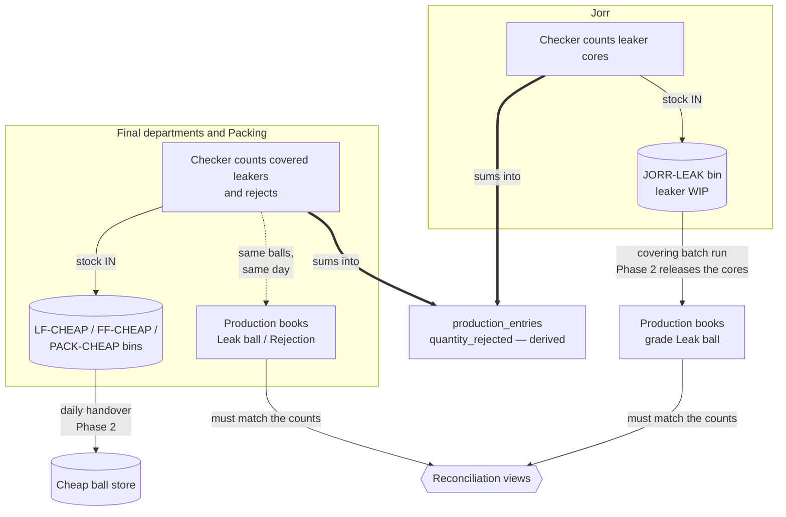

# R&W Ball Inventory — Working Flow

How the ball inventory works day to day, for the people running it: the floor
checkers, the production clerks, and the managers reading the reconciliations.
Design rationale lives in `docs/REJECTION_WASTAGE_INVENTORY_PLAN.md`; what was
shipped and when in `docs/RW_BALL_INVENTORY_CHANGELOG.md`.

**Live from 1 September 2026.** Entries dated before the cutover are history
only — they post no stock and touch no production figure.

---

## The idea in one paragraph

A leaker or reject ball is not waste — it is a countable ball that gets sold
cheap. So the checker's daily count now creates **stock in a bin**, and that
stock has to reconcile with what happens next: leaker cores must come back out
as *Leak ball* production after covering, and covered leakers and rejects must
match the cheap-ball production the same department books the same day. A
number that used to be a bare claim now has physical inventory and a second
recording it must agree with.

## How a ball flows

Two numbers are now derived, never typed:

- **`quantity_rejected`** on a production entry = the sum of every defect the
  checkers counted for that day/shift/department/grade (leakers included — a
  leaker is equally a ball that was not OK).
- **`quantity_ok`** = produced − rejected, so the three always add up.

---

## Daily routine

### The floor checker — once per day, per department

Open **Rejections & Wastages → Daily Checker Entry**.

1. Pick the date, department, shift, and (optionally) your name as checker.
2. The grid is already shaped for you: **columns** are the defect grades your
   department counts (Jorr sees only *Leaker — core*; Local/Fancy Final see
   *Leaker — covered* plus the two rejects; Packing sees the two rejects), and
   **rows** default to the models that were actually in production. The
   destination bin is shown at the top — you never pick a location.
3. Type the day's quantities per model. The defect % updates live against
   produced quantity; above 2% it flags amber for review.
4. Optional: expand a cell's chevron to record the interval tally (your
   through-the-day counts). If you use it, the intervals **must add up to the
   day total** — the save refuses otherwise. Leave it empty and the day total
   saves on its own.
5. **Save day's count.** One save per day; re-opening the same day lets you
   correct it (the stock and production figures follow automatically).

Things the screen will tell you:

- **Amber "no production grade" warning** — that model's count still posts to
  the bin, but it cannot reach the production entry's rejected figure until
  someone links the model to a grade in Master Data.
- A day/model/grade can only exist **once** — a duplicate save is refused
  rather than silently doubling the count.

### The production clerk

Nothing new to learn, one thing to unlearn: on **Daily Production Entry**,
*Qty OK* and *Qty Rejected* are now read-only from the cutover. They fill in
from the checker's count, and the note on the form links to where to change
them. Rejection reasons also live with the checker entry now — the old
per-reason card is gone.

Keep booking cheap-ball output as before (or start): production of grade
**Leak ball** (covered leaker cores, and covered leakers) and grade
**Rejection** (rejects), booked by the department that found the defect,
recording the **finished** balls. Those rows are never rewritten by the
derivation — they are output, not primary production.

### Posting a production day

Posting still freezes an entry, and the R&W side respects it: a checker
correction after posting does **not** force through the lock. The gap shows
up on the Floor Bin Stock page instead ("posted entry does not match the
floor count"); someone with the production approve permission unposts, the
figure updates by itself, and it can be re-posted.

---

## What the manager watches

All on **Rejections & Wastages → Floor Bin Stock** (plus the Ball Ledger for
drill-down):

| Signal | Meaning | Action |
|---|---|---|
| **Counted vs booked mismatch** | For grades with no covering step, the checker's count and the department's cheap-ball production describe the same balls on the same day — they must match exactly. (Stays quiet per department until that department books the grade at least once.) | Find out which number is wrong — same day, named department |
| **Leaker cores vs covering output** | Cores counted at Jorr, minus what the ledger has released, should be the bin; `bin_check ≠ 0` means a ledger problem. `unreleased_qty` is covering output whose cores haven't left the bin — until Phase 2 ships the cover transfer, that is every covering run and is *pending work, not a loss* | Watch the trend; Phase 2 turns this into a per-batch check |
| **Posted entry conflicts** | A posted production day no longer matches the count | Unpost (approve permission), let it update, re-post |
| **Coverage** (`v_rw_entry_coverage`) | A department produced but posted no checker count — silence is the cheapest way to hide balls | Chase the missing day |
| **Defect %** (`v_rw_defect_vs_production`) | Live leak/reject rate per department and grade | Out-of-band days deserve a look the same day |
| **Unlinked models** (`v_rw_unlinked_models`) | Models being counted whose production sync silently can't run | Fill `products.grade_id` in Master Data |

**Valuation:** every ledger row snapshots the unit cost at posting time from
**Cheap Ball Rates** (exact model rate wins, else the grade default). Changing
a rate later never rewrites past value. Until rates are filled in, counts post
at zero value — quantities are correct regardless.

---

## Before go-live (1 Sep) — the checklist

1. **Link the ball models to grades** (Master Data → Products,
   `grade_id`) — ~47 of 53 are unlinked; this is what makes the production
   sync work.
2. **Fill in Cheap Ball Rates** (Rejections → Cheap Ball Rates) so stock
   carries value.
3. **Glance over Department Checkpoints** (Rejections → Department
   Checkpoints) — Jorr/Local Final/Fancy Final/Packing are pre-seeded; adding
   a checker elsewhere later is a row here, not a code change.
4. Tell the checkers where the new screen is. The old entry page's Rejections
   and Leakages tabs disappear for post-cutover dates so there is only one
   place to type a ball; pre-cutover history stays readable there, and
   material wastage is unchanged.

---

## What Phase 2 adds (designed, not yet built)

- **Cover transfer** — a consumption document releasing leaker cores from the
  Jorr bin when a covering batch runs, reconciled against the *Leak ball*
  production it becomes. Turns `unreleased_qty` into a real per-batch check
  and separates "lost before covering" from "lost in covering".
- **Daily blind handover to the store** — the floor sends, the storekeeper
  counts *without seeing the sent figure*, and declared/sent/received are
  three recorded numbers with two attributable variances. The bin must read
  zero after receipt.
- **Store physical count** — periodic count against a frozen book snapshot,
  with segregation of duties and a period lock.

## If Phase 1 ever has to come out

`supabase/rollbacks/20260830_rw_ball_inventory_down.sql` removes everything
Phase 1 added and restores the previous `production_entries` behaviour. It is
kept outside the migrations folder so it can never run by accident; run it
manually, knowing any checker counts entered so far go with it.
